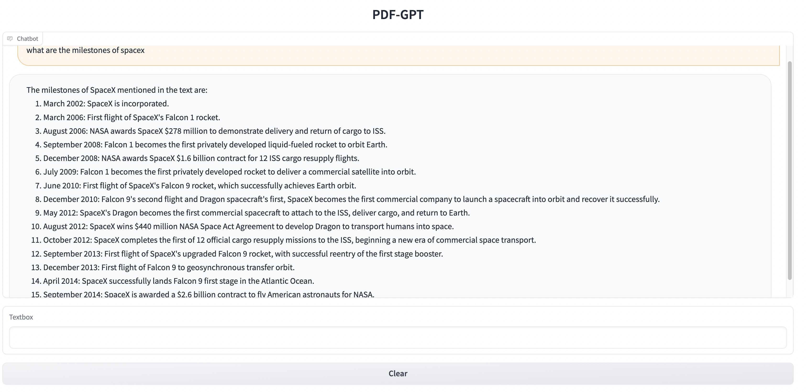
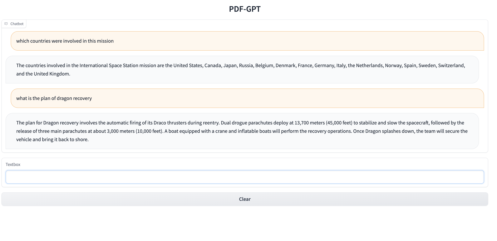
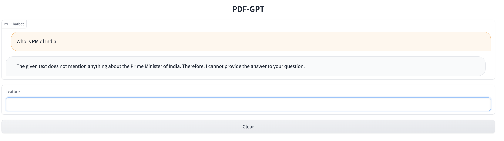

# Document-QA-GPT

## Overview
`document-qa-gpt` is a cutting-edge project leveraging the power of generative AI for document question answering. This project focuses on processing documents, chunking them into manageable parts, and then utilizing these chunks for question-answering tasks. For this project you need to have OpenAI's API key stored in file called key.txt in the root directory of the project. The key should be the only thing in the file.

If question asked is not relevant to the document, we will get the response as this information is not present in the document.

## Steps
- **Document Chunking**: Splits PDF documents into smaller, manageable chunks.
- **Embedding Generation**: Converts document chunks into embeddings using OpenAI's Embedding API.
- **FAISS Indexing**: Builds FAISS indexes on top of chunks using Hugging Face datasets for efficient searching.
- **Gradio Chatbot Interface**: A user-friendly chatbot interface built with Gradio allows users to input questions.
- **Embedding-based Search**: Converts questions into embeddings and performs a nearest neighbor search to find the most relevant document chunks.
- **GPT-based Answer Generation**: Utilizes OpenAI's ChatGPT Turbo 3.5 API, combined with prompt engineering, to generate answers based on the question and the context provided by the document chunks.

## How to Use
1. **Chunking the Document**:
   - Input your document to be chunked into the system.

2. **Question-Answering**:
   - Through the Gradio interface, input your question.
   - The system will process your question, search for relevant chunks, and pass the combined information to the GPT model.
   - Receive your answer, generated based on the context of the document.

## Screenshots

